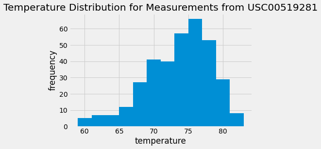
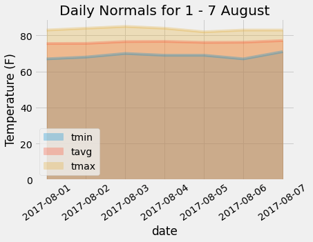

# sqlalchemy-challenge

### contains
- resources folder:
    - hawaii.sqlite: source database for climate_analysis.ipynb and temp_analysis2.ipynb, containing precipitation, temperature, and station data for weather stations in Hawai'i
    - hawaii_measurements.csv: source CSV for temp_analysis1.ipynb, containing precipitation and temperature data for weather stations in Hawai'i
- climate_starter.ipynb: a jupyter notebook showing analysis of hawaii.sqlite resulting in graphs of rainfall and temperature over the last 12 months in the data set
- temp_analysis1.ipynb: a jupyter notebook showing analysis of hawaii_measurements.csv, resulting in a paired t-test
- temp_analysis2.ipynb: a jupyter notebook showing analysis of hawaii.sqlite resulting in graphs of average temperature and daily normals during 1 - 7 August 2017
- app.py: a script using flask and queries to hawaii.sqlite to display static and dynamic webpages relating to the  precipitation, station, and temperature data

### description
The goal of climate_starter.ipynb was to create a bar graph of rainfall over the last 12 months listed in the dataset, and a histogram of the distribution of temperature measurements taken from the station that had the most measurements. Several preliminary steps were required to process the data from the stations to create the graphs:
- Reflection of tables within hawaii.sqlite into SQLAlchemy:
    - using create_engine to establish a connection to the sqlite database
    - using Base (automap_base) to reflect the tables
- Investigating the contents of the sqlite database:
    - using Base.classes.keys() to reveal the names of the tables (Measurement, Station), and set those table names as classes within SQLAlchemy
    - opening a session for making queries to the sqlite database
    - querying the first row of each table as a dictionary to reveal the column names, and the sort of data found within each column
- Creating a bar graph of the precipitation data for the last 12 months in the dataset:
    - finding the date range of the last 12 months of the dataset
        - finding the last date in the dataset
            - querying the date column in the Measurement table, ordering the dates in descending order, and returning the first result (the 'greatest' date, or, the most recent date); saving that result to the variable latest_date
            - separating latest_date into year, month, and day components (ld_year, ld_month, ld_day) for use within datetime
        - finding the date a year before the final date
            - creating a date object out of the components of latest_date (dt.date(ld_year, ld_month, ld_day))
            - creating another datetime object that would be a year before latest_date (dt.timedelta(days=365))
            - subtracting the second datetime object from the first, and formatting it to fit the date structure within the Measurement date column (.strftime('%Y-%m-%d)), and saving the result to variable year_before
    - creating a dataframe of the last 12 months precipitation data to graph from
        - querying the Measurement table
            - opening a query on the Measurement table, filtering for the date being greater than or equal to year_before
        - creating and cleaning up lists to make into the dataframe
            - conducting a for loop on the query and appending date and prcp (precipitation) columns in each row to empty lists dates_list and precips_list
            - using a list comprehension to replace 'none' values in the precips_list with zeros, and saving the new list to precips_list_fix
        - creating the dataframe
            - making the dataframe prcp_data out of a dictionary containing the dates_list and precips_list_fix
            - setting the date column as the index, and sorting the index so that dates will be sequential
    - graphing the precipitation data for the last 12 months in the dataset
        - graph labelling experimentation and set-up
            - testing to see if each date in prcp_data has an equal number of data points for labelling every nth value
                - using the .unique() function on prcp_data.index in a list comprehension, saved as each_date, to have a list of all the unique dates in the dataframe
                - for loop to append the number of rows each date has to a list, num_measurements, taking the set of that list (unique_no_measurements), which contains four different lengths -- the dates have different numbers of rows attached to them
            - setting xticks and labels for only every 250 data points
                - using the numpy arange function to create a list (nums_of_x) from 1 to the length of the precipitation column in the prcp_data dataframe, plus  1 (since the dataframe will start at index 0), taking steps of 250
                - using a list comprehension to append all the dates in prcp_data.index to list x_names
                - using nums_of_x and x_names to append the value within x_names at the index of each number within nums_of_x to list x_labels
        - creating the bar graph 'precipitation by date between 23 August 2016 and 23 August 2017'
            - using list num_of_x to set the xticks
            - using list x_labels to set the xtick labels
            - using zorder to set the grid behind the bars
<figure>
    
</figure>

- summary statistics for precipitation data
    - calling .describe() on prcp_data dataframe
- finding the date within the last year with the highest rainfall
    - calling max() on the precipitation column within prcp_data
    - filtering prcp_data for where the precipitation was at its maximum value
- finding the number of stations within the dataset
    - finding the number of stations within the Station table
        - querying the Station table's id column, grouping by the id column, and applying .count()
    - finding the number of stations within the Measurement table
        - querying the Measurement table's station column, grouping by the station column, and applying .count()
    - conducting an inner join and counting the stations from the resulting join
        - joining the Measurement table's station column and the Station table's name column filtering where the two columns match, grouping by the id column, and calling .count()
- creating a histogram of the distribution of the temperature measurements on the most prolific station
    - finding the station with the most measurements
        - querying the Measurement table for the station column and the count of the id column, grouping by the station column, ordering by the count of the id column in descending order, and saving the result to a variable stations_count
        - creating a for loop to print each row in stations_count
        - saving the first item in the first row of stations_count (stations_count[0][0]) as most_active_station_id
    - finding the lowest, highest, and average temperature for the most active station
        - querying the Measurement table's column tobs (temperature observations), applying the function to find the maximum value (func.max), and filtering for rows only where the station column matches most_active_station_id, saving the result to max_temp
        - applying the same query for minimum and average temperature, changing the function to func.min or func.avg, saving the results to min_temp and avg_temp
    - creating a dataframe containing the temperature measurements for the most active station id, for the last 12 months of the dataset
        - querying the Measurement table for the tobs and id columns, filtering for all dates greater than or equal to the year_before variable, and filtering for only the most active station id
        - calling pd.DataFrame() on the results of the query, and saving it to a dataframe, temps_df
        - setting the id column as the index of temps_df
    - graphing the histogram
        - calling .hist() on temps_df, using 12 bins, and a zorder of 3 to have the bars show in front of the grid

    

- summary statistics for temperature data
    - calling .describe() on temps_df dataframe
    
The goal of app.py was to build on the analysis done in climate_starter.ipynb, and display queries relating to the precipitation, station, and temperature measurements from hawaii.sqlite on static webpages. Additionally, the file would contain routes to create dynamic webpages that would take user input to display temperature statistics for chosen dates. The following steps were taken to achieve these goals:
- setting up the database within the file
    - using create_engine to make a connection with the sqlite database
    - using Base (automap_base()) to reflect the database into the file
    - using Base to save the Measurement and Station tables (already known from previously opening the database within the jupyter notebook) into classes for use in the file
- creating variables for use across multiple routes/functions
    - opening a session with the sqlite database
    - re-using code from jupyter notebook for defining latest_date, ld_year, ld_month, ld_day, year_before, most_active_station_id
    - querying Measurement table's date column, appending the first four digits (the year) within each row's first element to years_list, making a set of and sorting the list to create unique_years_list
- setting up Flask and creation of routes
    - home route to list available routes
        - defining home() function to:
            - print the request made to the Terminal
            - open a session
            - return available routes with descriptions, followed by a note of the format to follow for entering dates for the user-input routes
            - close the session
    - precipitation route to return all the precipitation data for the last year in the dataset
        - defining precipitation() function to:
            - print the request made to the Terminal
            - open a session
            - reuse the code from the jupyter notebook, querying the Measurement table, filtering for all dates greater than or equal to year_before, and save it to the variable pdata
            - create a for loop to append the date from each row in pdata as a key, and the precipitation from each row as a value, to an empty dictionary prcp_dict
            - close the session
            - return the jsonified prcp_dict
    - stations route to list stations in the database
        - defining stations() function to:
            - print the request made to the Terminal
            - open a session
            - edit code from jupyter notebook, querying to join the Station and Measurement tables, filtering where the Station table's station column matches the Measurement station column, and select the Measurement table's station column, and the Station table's name column
            - create a for loop over the query to append the second item in each row (each station's name) to an empty list stations_list
            - close the session
            - return the jsonifed stations_list
    - tobs route to list the temperature observations for each date for the most active station ID in the database
        - defining temps() function to:
            - print the request made to the Terminal
            - open a session
            - query the Measurement table's tobs column, filtering where the station column matches most_active_station_id, where the date is greater than or equal to year_before
            - create a for loop over the query to append the first item in each row to an empty list temps_list
            - close the session
            - return the jsonifed temps_list
    - start route to list the minimum, maximum, and average temperature for the most active station, within a date range from a start date inputted by the user, to the last date in the dataset
        - defining start_date_lookup() function, taking the user input variable 'start' to:
            - print the request made to the Terminal
            - open a session
            - create a conditional to return an error message if the date format is wrong, or the year entered is not within the dataset
                - comparing the first four characters within 'start' to the unique_years_list
                - returning an error with a reminder of the date format and the years available
            - prepare the user input 'start' for querying
                - setting 'start' as type string, and splitting it into year, month, and day sections (start_year, start_month, start_day)
                - setting the sections of start as type integer for use within datetime, then using datetime to create a date object, and formatting it with dashes to fit the style of the Measurement table, saving it to the variable start_search
            - edit the code in the jupyter notebook to query the Measurement table's tobs column, applying the func.max() function to it, filtering for the rows where the station is the most_active_station_id, and the date is greater than or equal to start_search, and saving the result as max_temp
            - repeat the process for the minimum and average temperature, using func.min() and func.avg() to create the variables min_temp and avg_temp
            - close the session
            - create a dictionary, temp_for_station_dict, with 'minimum temperature', 'maximum temperature', and 'average temperature' labels as keys, and max_temp, min_temp, and avg_temp (the last rounded to two decimal places) as values
            - return the jsonified temp_for_station_dict
    - start/end route to list the minimum, maximum, and average temperature for the most active station, within a date range from a start and end date inputted by the user
        - defining full_date_lookup() function, taking the user input variables 'start' and 'end' to:
            - print the request made to the Terminal
            - open a session
            - create a conditional to return an error message if the date format is wrong, or the year entered is not within the dataset
                - comparing the first four characters within 'start' to the unique_years_list
                - returning an error with a reminder of the date format and the years available
            - prepare the user inputs 'start' and 'end' for querying
                - setting 'start' and 'end' as type string, and splitting it into year, month, and day sections (start_year, start_month, start_day, end_year, end_month, end_day)
                - setting the sections of start and end as type integer for use within datetime, then using datetime to create a date object, and formatting it with dashes to fit the style of the Measurement table, saving it to the variables start_search and end_search
            - edit the code in the jupyter notebook to query the Measurement table's tobs column, applying the func.max() function to it, filtering for the rows where the station is the most_active_station_id, and the date is between start_search and end_search, and saving the result as max_temp
            - repeat the process for the minimum and average temperature, using func.min() and func.avg() to create the variables min_temp and avg_temp
            - close the session
            - create a dictionary, temp_for_station_dict, with 'minimum temperature', 'maximum temperature', and 'average temperature' labels as keys, and max_temp, min_temp, and avg_temp (the last rounded to two decimal places) as values
            - return the jsonified temp_for_station_dict
- allowing the application to run in the Terminal

The goal of temp_analysis1.ipynb was to determine whether there is a statistically significant difference between temperatures in June and December through the years documented in hawaii_measurements.csv. The following steps occurred to carry out that purpose:
- Loading and processing the source csv into a dataframe
    - using pd.read_csv to load the CSV into a dataframe (df)
    - converting the data type of the date column in df from 'string' to 'datetime', so they would be read as dates by python
    - setting the date column as the index of df
    - dropping any rows with null values in any of the columns
- Extracting data for target months (June, December)
    - creating new dataframes (june_df, dec_df) where the month in the date index is limited to '6' (for June) or '12' (for December)
    - finding the average temperature for June/December (june_mean, dec_mean)
    - using list comprehensions to create lists (june_temps, dec_temps) to hold the temperature data points for June and December
- Determining statisical significance between the two lists of temperature data
    - finding the length of june_temps and dec_temps to see if they have the same amount of data points
    - conducting a paired t-test
        - importing the random library to create a sample from the june_temps list that is of the same length as that of dec_temps
        - creating a for loop to run the paired t-test 10,000 times to try to offset the need to take a sample from the june_temps list

The goal of temp_analysis2.ipynb was to predict the rainfall and temperature during a theoretical future trip to Hawai'i in 1 - 7 August, based on the temperature data from hawaii.sqlite in 1 -7 August 2017. In order to do this, these steps were taken:
- SQLAlchemy setup
    - reflecting tables from the database
        - using Base (automap_base) to show the names of tables within the database (Measurement, Station)
        - saving the table names as classes for use in the  notebook
    - using Session(engine) to create a connection between the database and python
- minimum, maximum, and average temperature over 1-7 August 2017
    - function calc_temp: queries Measurement table columns tobs (temperature), filtering for data between a user input start date and end date; applying functions func.min(), func. avg() and func.max() to find minimum, average, and maximum temperatures over the time period
    - using calc_temp for the date range of interest, saving the results to the variables tmin (minimum temperature), tavg(average temperature), tmax (maximum temperature)
    - bar chart with error bar of the average temperature over 1-7 August
        - using plt.bar to plot one bar, with the height of the bar representing the average temperature over the chosen time period
        - the y-error bar is the difference between the minimum temperature and the maximum temperature (peak-to-peak)

<figure>
    
</figure>

- total rainfall over 1-7 August 2017
    - using datetime to create date objects of the chosen dates, formatted in the style of the database table dates, for use in queries, saving as variables start_date, end_date 
    - query to find the total rainfall over the time period
        - querying the Measurement and Station tables together (join) for each station's name, ID, latitude, longitude, and elevation, 
        - applying the function func.sum() on the prcp  (precipitation) column to get the total rainfall
        - filtering for the date range 1-7 August 2017
        - grouping by station ID
        - ordering by total rainfall, in descending order
- daily normals (averages of minimum, maximum, average) of temperature data over 1-7 August for all years
    - function daily_normals: queries the Measurement column tobs (temperature), applies the functions func.min, func.max, func.avg, filtering for dates that contain a user input month and day number
    - querying the Measurement table to return all dates are equal to or between start_date and end_date, and appending the results to list date_list
    - stripping the years from date_list using a list comprehension, to create list date_list_md, for use with daily_normals
    - using a list comphrension to append the results from applying daily_normals to every element in date_list_md, to list normals
    - using list comprehensions to split the tuples returned by daily_normals into three lists for temperature minimums, maximums and averages (tmins, tmaxs, tavgs)
    - using date_list, tmins, tmaxs, and tavgs to make the dataframe normals_df, setting the index as the date
    - area plot of daily normals
        - using pd.plot.area to create an area plot of the temperature daily normals for all dates within 1-7 August for each year in the dataset

<figure>
    
</figure>

### challenges/observations

#### challenges
##### precipitation data bar graph (climate_analysis.ipynb)
One challenge within this project was properly graphing the precipitation data in climate_analysis.ipynb. An initial graphing attempt led to the x axis labels being illegible, as each data point has a 3 part date as a label, and there are 2230 data points to fit on one plot. 

One solution, if each date had the same amount of data points, would be to label only the first data point for each date. However, the dates varied in terms of how many data points they had, so this could not be done simply. Morever, even if there were an equal amount of data points per date, that would still be 365 labels, which is still unwieldy for a plot. 

The solution that was implemented was to assign x-ticks, and x-labels, for every 250 points, resulting in 9 labels. This leads to an uncluttered plot and provides a good overview of the year, but reduces clarity, if one wants to trace a spike in data using just the graph. Graphing over smaller spans of time would probably be the best way of visually identifying points of interest. 

##### t-test on June and December temperatures (temp_analysis1.ipynb)
Another point of difficulty was in deciding the type of t-test to use in temp_analysis1.ipynb. Comparing weather station measurements at the same place(s) at different times seemed like a good candidate for a paired t-test, as it fits the concept of the same subjects at different times/under different conditions. However, a paired t-test requires arrays of the same length: even after dropping rows with no/missing data, the June and December data frames had different lengths. 

One might think a solution could be to go through the dataframes and drop all rows with duplicate dates, but since the months have different numbers of days in them, it would still not lead to an equal number of data points. Moreover, that would make for smaller data sets, which can be more prone to outliers. 

The solution that was finally implemented was to use the library random to take a sample from the larger (June) dataset equal in number to the December data set, and run the paired t-test using the sample from June and the full December set. In order to offset the effect of taking a sample, not the whole dataset, the t-test was done inside a for loop so that the test could be run 10,000 times.During each run of the loop, the sampling was re-done, so that different data was selected from june_temps, to test whether slightly different data would change the significance value of the t-test. All runs of the loop resulted in p-values equal to or less than 0.05, meaning there was a statistically significant difference in means for each generated version of the June data sample.  

#### observations
##### climate_analysis.ipynb

The summary statistics table and bar chart in climate_analysis.ipynb, showing precipitation data between 23 August 2016 and 23 August 2017 reveals that Hawai'i generally had low levels of rainfall throughout the year, with an average rainfall of less than 1/5 of an inch (0.161), with several spikes of rainfall throughout the year, with its highest rainfall of the year on 14 November 2016. A further point of research could be to compare the average of this time period to the average of each other year period, and the years overall, as well as the graphs of each year's data, as a way of determining whether the pattern shown in this graph is typical. 

The histogram from the same notebook shows a slighly asymmetrical, but still fairly bell-shaped curve for the temperature measurements for the most prolific station, over 23 August 2016-23 August 2017. For that year, and for that station, the majority (within one standard deviation of the mean) of the measurements fell between 68.38 and 77.84 F, showing a fairly mild climate. The average temperature and distribution could be compared across the years in the dataset to see if the average temperatures have risen or fallen, although the dataset's span could be too short to pull out significant trends. The decision to look at the station with the most measurements is so as to attempt to avoid a small dataset being overwhelmed by outliers. 

##### temp_analysis1.ipynb

As discussed in the analysis section in temp_analysis1.ipynb, the t-test showed a statistically significant difference in June and December average temperatures, although the difference is only four degrees Fahreneheit. T-tests could be done on other climate factors in order to get a fuller picture of the feeling of being in Hawai'i during those months. 

##### temp_analysis2.ipynb

The premise behind temp_analysis2.ipynb was determining whether the week of 1 - 7 August had temperatures and rainfall appropriate for a holiday. Based on the data from that date range in 2017, one could expect temperatures between 72 and 83 F (the maximum and minimum temperature values) and an average temperature of 79.25 F. Observing the normals_df area plot shows the temperature staying relatively constant over the whole period. 

The weather station with the highest total amount of rainfall over the period showed less than half (0.36) of an inch of rain, with 3/5 of the weather stations showing less than a tenth of an inch of rain. Overall, 1 - 7 August would appear to be a good time to go to Hawai'i, with mild contstant temperatures and low levels of rain. A potential issue with this prediction is the length of the data set. The temperature prediction only relies on one year's data, which could have been an outlier. Seven years of data used in the rainfall also might not be enough to observe trends in rainfall. 